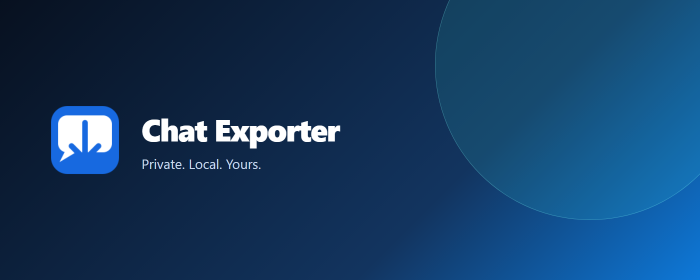

# Chat Exporter by Tom Raz

**Export AI conversations to Markdown or plain text — locally in your browser.**

[](https://chromewebstore.google.com/detail/chat-exporter-by-tom-raz/ljgpghdicijmjojfnhmpefjpipfakoen)
[](https://microsoftedge.microsoft.com/addons/detail/chat-exporter-by-tom-raz/nmmpfdnapkfklcbfgcmkahcjcclophhk)
[](https://addons.mozilla.org/he/firefox/addon/chat-exporter-by-tom-raz/)
[](https://github.com/talktome8/chat-exporter/releases/tag/v1.0.0)
[](LICENSE)

| Install | Browser |
| --- | --- |
| [Install from Chrome Web Store](https://chromewebstore.google.com/detail/chat-exporter-by-tom-raz/ljgpghdicijmjojfnhmpefjpipfakoen) | Chrome |
| [Install from Microsoft Edge Add-ons](https://microsoftedge.microsoft.com/addons/detail/chat-exporter-by-tom-raz/nmmpfdnapkfklcbfgcmkahcjcclophhk) | Microsoft Edge |
| [Install from Firefox Add-ons](https://addons.mozilla.org/he/firefox/addon/chat-exporter-by-tom-raz/) | Firefox |



## What it does

Open a supported AI conversation, click the extension, choose the content and format, then download or copy the result. Chat Exporter can export messages that are already loaded on the page, or verify a full conversation when completeness matters.

Everything is processed on the device. The extension has no account, analytics, server, remote executable code, advertising, or donation prompts.

## Support at a glance

| Area | v1.0.0 support |
| --- | --- |
| Verified platforms | ChatGPT, Claude, Gemini, Microsoft Copilot, Perplexity |
| Beta platforms | Grok, Mistral — review exports for accuracy |
| Export formats | Markdown (`.md`), plain text (`.txt`), copy to clipboard |
| Processing | Local only — conversation content is not sent to Tom Raz or a third party |
| Languages | English and Hebrew (RTL) |

## Features

- Choose user messages, AI responses, or both.
- Include optional title, model, date, and conversation URL metadata.
- Export immediately from the messages already loaded on the page.
- Use **Check full conversation** when you need the extension to load earlier messages and report a complete, partial, or unknown result.
- Preserve readable Markdown, including code blocks, lists, links, and tables where they are available in the page.

## Privacy and permissions

The extension requests only `activeTab`, `scripting`, and `storage`:

- `activeTab` reads the active conversation only after you click the extension.
- `scripting` runs the packaged extractor in that tab.
- `storage` remembers the English/Hebrew interface preference locally.

Read the full [Privacy Policy](PRIVACY.md) and [Security Policy](SECURITY.md).

## Development

```bash
npm install
npm run check
```

`npm run check` runs linting, unit tests, extension linting, deterministic packaging, package verification, the static-site build, and rendered-page checks.

To load the extension locally, use the `extension/` directory in Chromium browsers, or run `web-ext run --source-dir extension` for Firefox development.

## Release assets

The signed store builds are based on the `v1.0.0` package. The GitHub release contains the reviewed ZIP and its SHA-256 checksum for integrity verification.

## Support and contributions

- Report a reproducible issue through [GitHub Issues](https://github.com/talktome8/chat-exporter/issues).
- Review [CONTRIBUTING.md](CONTRIBUTING.md) before proposing a change.
- See [CHANGELOG.md](CHANGELOG.md) for release history.

Chat Exporter is open source under the [MIT License](LICENSE).
